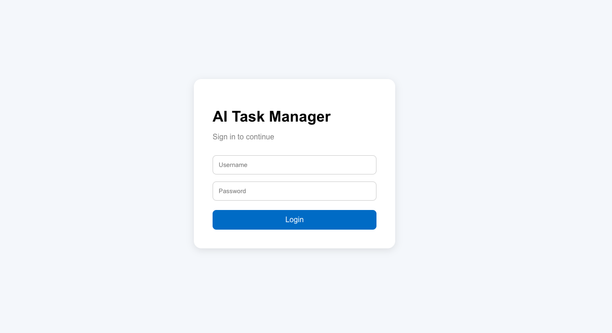
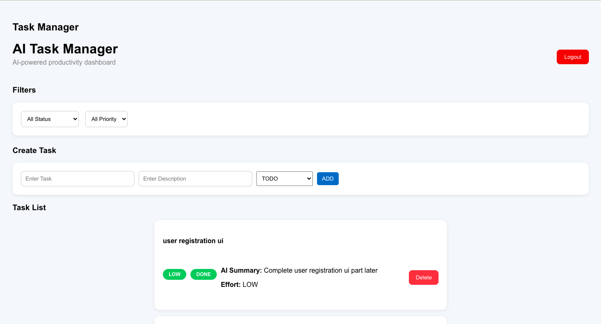
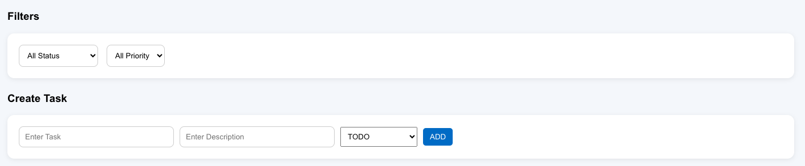
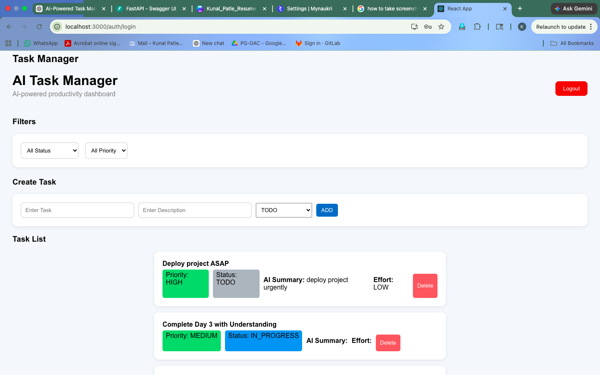
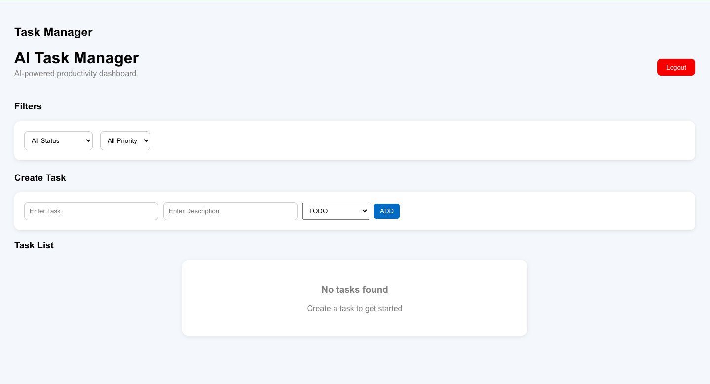
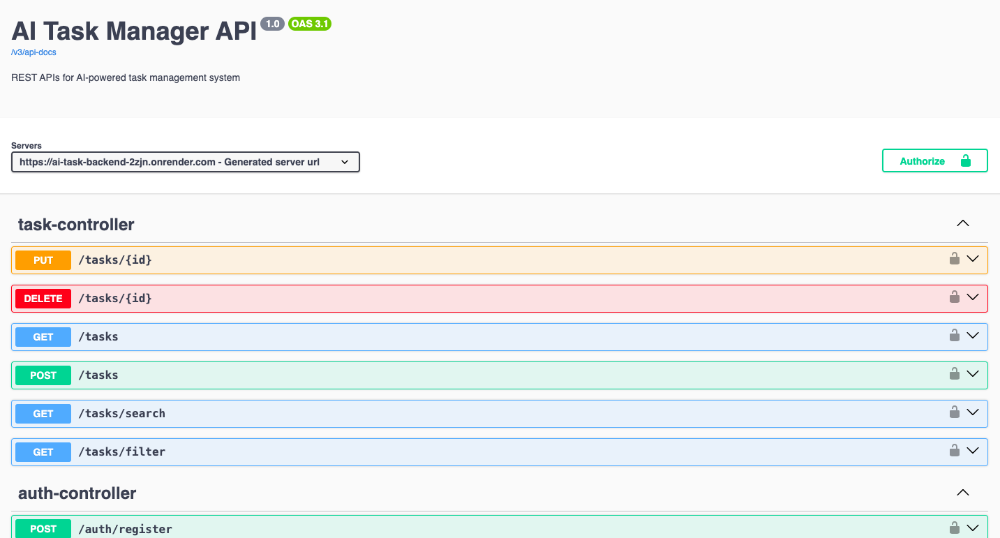

# AI-Powered Task Management System

## Overview

A production-grade AI-powered full-stack task management platform built using Spring Boot, React, FastAPI, PostgreSQL, Docker, Render, and Vercel.

The system enables users to securely manage tasks while leveraging AI-powered task analysis for intelligent prioritization, effort estimation, and task summarization.

This project was designed to simulate real-world product engineering challenges including:

* Full-stack architecture
* JWT-based authentication
* REST API design
* AI microservice integration
* Dockerized deployment
* Cloud-native deployment
* Distributed system communication
* Production debugging

---

# Live Application

## Frontend (Vercel)

[https://ai-task-management-ui.vercel.app](https://ai-task-management-ui.vercel.app)

## Backend API (Render)

[https://ai-task-backend-2zjn.onrender.com](https://ai-task-backend-2zjn.onrender.com)

## AI Service (Render)

[https://ai-task-ai-service.onrender.com](https://ai-task-ai-service.onrender.com)

## Swagger API Documentation

[https://ai-task-backend-2zjn.onrender.com/swagger-ui/index.html](https://ai-task-backend-2zjn.onrender.com/swagger-ui/index.html)

## GitHub Repository

[https://github.com/KunalP1303/AI_TaskManagement_Application](https://github.com/KunalP1303/AI_TaskManagement_Application)

---

# Architecture

```text
React Frontend (Vercel)
        ↓
Spring Boot Backend (Render)
        ↓
FastAPI AI Microservice (Render)
        ↓
PostgreSQL Database
```

---

# Key Features

## Authentication & Security

* JWT-based authentication
* BCrypt password encryption
* Protected APIs using Spring Security
* Token-based authorization
* Secure frontend-backend communication

## Task Management

* Create tasks
* Update tasks
* Delete tasks
* Task filtering
* Pagination support
* Priority management
* Status tracking

## AI-Powered Features

Integrated FastAPI AI microservice for:

* Intelligent priority suggestion
* Effort estimation
* AI-generated task summaries

## Backend Engineering

* DTO-based API design
* Global exception handling
* Request validation
* Standardized API responses
* Layered architecture
* Production-grade REST APIs

## Frontend Features

* React component-based architecture
* Axios API integration
* Loading & error states
* JWT interceptor handling
* Protected API calls
* Dynamic UI rendering

## DevOps & Deployment

* Dockerized services
* Multi-stage Docker builds
* Cloud deployment using Render & Vercel
* PostgreSQL cloud integration
* Environment variable configuration
* Swagger/OpenAPI integration

---

# Tech Stack

| Layer             | Technology                  |
| ----------------- | --------------------------- |
| Frontend          | React.js                    |
| API Integration   | Axios                       |
| Backend           | Spring Boot 3.5.x           |
| Language          | Java 17                     |
| Security          | Spring Security + JWT       |
| ORM               | Spring Data JPA / Hibernate |
| AI Service        | FastAPI                     |
| Database          | PostgreSQL                  |
| Containerization  | Docker                      |
| Backend Hosting   | Render                      |
| Frontend Hosting  | Vercel                      |
| API Documentation | Swagger/OpenAPI             |
| Version Control   | Git + GitHub                |

---

# System Design Highlights

## Distributed Architecture

The application follows a distributed architecture where:

* React frontend communicates with secured Spring Boot APIs
* Spring Boot backend communicates with FastAPI AI microservice
* AI service enriches tasks with intelligent analysis
* PostgreSQL persists application data

## Authentication Flow

```text
User Login
    ↓
JWT Token Generated
    ↓
Stored in localStorage
    ↓
Axios Interceptor attaches token
    ↓
Spring Security validates token
    ↓
Protected APIs accessed
```

## AI Integration Flow

```text
Task Creation Request
        ↓
Spring Boot Backend
        ↓
FastAPI AI Service
        ↓
AI Analysis Generated
        ↓
Response returned to Backend
        ↓
Task saved with AI enrichment
        ↓
Frontend updated
```

---

# API Features Implemented

## Implemented

* CRUD APIs
* Pagination
* Filtering
* DTO Layer
* Global Exception Handling
* Validation
* Protected APIs
* Swagger Documentation
* Standardized API Responses

## Not Implemented Yet

* Role-based authorization
* Refresh token flow
* Advanced search functionality

---

# Major Engineering Concepts Applied

## Backend

* REST API design
* DTO mapping
* Exception handling architecture
* Validation lifecycle
* Spring Security filter chain
* JWT authentication
* BCrypt hashing
* JPA/Hibernate ORM
* Layered architecture
* API contract design

## Frontend

* React hooks
* State management
* Component architecture
* Axios interceptors
* Conditional rendering
* API integration patterns
* Error handling

## DevOps

* Docker containerization
* Multi-stage Docker builds
* Cloud deployment
* Environment variable management
* CI/CD workflow
* Cross-origin configuration

## AI Integration

* Microservice communication
* API contract debugging
* Distributed system interaction
* Request/response validation

---

# Real-World Problems Solved

This project involved solving several production-like engineering issues:

* JWT authentication failures
* CORS configuration issues
* Docker build failures
* PostgreSQL migration problems
* Swagger security conflicts
* 502 Bad Gateway issues
* Cloud deployment debugging
* Inter-service communication issues
* Validation and enum conversion errors
* Async frontend rendering issues

---

# Local Setup Instructions

## Prerequisites

Install:

* Java 17
* Node.js
* Docker
* PostgreSQL
* Maven
* Python 3.10+

---

# Backend Setup

## Clone Repository

```bash
git clone https://github.com/KunalP1303/AI_TaskManagement_Application.git
```

## Navigate to Backend

```bash
cd backend
```

## Configure Environment Variables

Update:

```properties
spring.datasource.url=
spring.datasource.username=
spring.datasource.password=
jwt.secret=
```

## Run Backend

```bash
mvn spring-boot:run
```

Backend runs on:

```text
http://localhost:8080
```

---

# Frontend Setup

## Navigate to Frontend

```bash
cd frontend
```

## Install Dependencies

```bash
npm install
```

## Run Frontend

```bash
npm start
```

Frontend runs on:

```text
http://localhost:3000
```

---

# AI Service Setup

## Navigate to AI Service

```bash
cd ai-service
```

## Install Dependencies

```bash
pip install -r requirements.txt
```

## Run FastAPI Service

```bash
uvicorn main:app --reload
```

AI service runs on:

```text
http://localhost:8000
```

---

# Docker Setup

## Build Backend Image

```bash
docker build -t ai-task-backend .
```

## Run Container

```bash
docker run -p 8080:8080 ai-task-backend
```

---

# Screenshots

## Login Page



## Dashboard UI



## Task Creation & Filtering



## AI-Powered Task Analysis



## Empty State UI



## Swagger API Documentation



## Screenshot Setup Instructions

Create a folder named:

```text
screenshots
```

Inside your GitHub repository root and add the screenshots using these filenames:

```text
login-page.png
dashboard-ui.png
task-creation-filtering.png
ai-task-analysis.png
empty-state.png
swagger-ui.png
```

# Resume-Oriented Highlights

This project demonstrates:

* Full-stack development capability
* Production-grade backend engineering
* Distributed system understanding
* Secure authentication implementation
* AI microservice integration
* Cloud deployment knowledge
* Dockerization skills
* Real-world debugging ability

---

# Future Enhancements

Potential improvements:

* Role-based access control
* Redis caching
* Kafka/event-driven architecture
* Search optimization
* WebSocket notifications
* AWS deployment
* CI/CD pipeline automation
* Monitoring & logging integration

---

# Author

## Kunal Patle

Java Full Stack Developer

### Connect

* GitHub: [https://github.com/KunalP1303](https://github.com/KunalP1303)
* LinkedIn: [https://www.linkedin.com/in/kunal-patle-514ba4156/](https://www.linkedin.com/in/kunal-patle-514ba4156/)

---

# Final Outcome

This project evolved from a basic CRUD application into a distributed AI-powered full-stack platform with:

* Secure authentication
* AI-powered task enrichment
* Dockerized deployment
* Cloud-native architecture
* Production-grade API design
* Distributed service communication
* Frontend-backend integration

The project reflects practical engineering skills aligned with modern full-stack Java developer roles.
